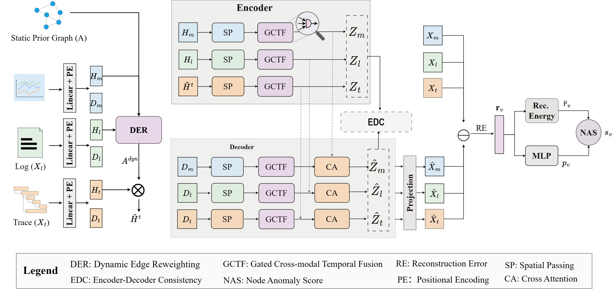

# Ada-MGAD: Adaptive Multi-Modal Graph Anomaly Detection

This repository contains the code for the paper "Ada-MGAD: Adaptive Multi-Modal Graph Anomaly Detection".



## Environment

The code has been developed and tested with the following environment:

- Python 3.8
- PyTorch 1.12.0
- PyTorch Geometric 2.2.0

Install dependencies with:

```bash
pip install -r requirements.txt
```

## Datasets

### MSDS

Dataset link:

- https://zenodo.org/record/3549604

Default paths after preprocessing:

```text
data/
|-- MSDS/concurrent_data/
|-- MSDS-pre/
`-- MSDS-save/
```

`MSDS-pre` stores the preprocessed raw modalities, and `MSDS-save` stores the cached sliding-window dataset used during training and evaluation.

### GAIA

Dataset link:

- https://github.com/CloudWise-OpenSource/GAIA-DataSet

Default paths after preprocessing:

```text
data/
|-- GAIA/MicroSS/
|-- GAIA-pre/
`-- GAIA-save/
```

`GAIA/MicroSS` stores the downloaded raw data, `GAIA-pre` stores the preprocessed files, and `GAIA-save` stores the cached sliding-window dataset.

## Usage

### MSDS

1. Preprocess the raw MSDS data:

```bash
python util/MSDS/pre_MSDS.py
```

2. Train with the default MSDS configuration:

```bash
python main.py --dataset msds
```

### GAIA

1. Download the GAIA dataset and place the raw files under `data/GAIA/MicroSS/`.

2. Preprocess the raw GAIA data:

```bash
python util/GAIA/pre_GAIA.py
```

3. Train with the default GAIA configuration:

```bash
python main.py --dataset gaia
```

### Smoke Test

For a quick end-to-end check, the repository includes a small bundled smoke-test example:

```bash
bash scripts/run_msds_smoke.sh
```

This command runs a short CPU test to verify that the codebase, model, and data loading pipeline work correctly.

### Evaluation

To evaluate a saved run, provide the result directory with `--model_path`:

```bash
python main.py --dataset msds --evaluate true --model_path ./result/<run_dir>
python main.py --dataset gaia --evaluate true --model_path ./result/<run_dir>
```

## Acknowledgements

We thank the authors of the public datasets and baseline methods used in our experiments. Their open-source implementations are valuable references for reproduction and comparison.

## Baselines

- [TraceAnomaly](https://github.com/NetManAIOps/TraceAnomaly)
- [TranAD](https://github.com/imperial-qore/TranAD)
- [USAD](https://github.com/manigalati/usad)
- [DeepTraLog](https://github.com/FudanSELab/DeepTraLog)
- [Hades](https://github.com/BEbillionaireUSD/Hades/)
- [UniDiag](https://github.com/AIOps-Lab-NKU/UniDiag)
- [Eadro](https://github.com/BEbillionaireUSD/Eadro)
- [MSTGAD](https://github.com/alipay/microservice_system_twin_graph_based_anomaly_detection)
