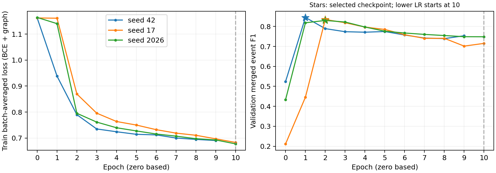

# P6 冻结候选 Test 全面比较与严格复盘

日期：2026-10-02（Asia/Shanghai）。状态：**全部完成，独立数值审计 PASS**。

本轮按用户授权评估已有方案，没有启动新 detector 训练或全量预处理。
覆盖10个已有 score model、19个检测臂、38组冻结68D XGB scorer接入比较、
2个固定Train拟合的特征消融，并核验P5和C1既有结果。
三个TCN seed全部报告；没有根据Test调threshold、offset、超参数、选checkpoint或挑seed。

报告分支：`analysis/p6-test-comparison-20261002`。
报告工作树：`/home/zhangll24/RCA_project/Ada-MGAD-e2e-v2-testreport`。
实际执行：detector commit `1b0efe92e43b81ded698239387571de73f6fe185`；
RCA commit `e4b80ef2067d5e74c5c2b8343faaead4894da3f2`。
本地主树和GitHub `e2e-v2` HEAD均为 `8d69ebaf3a8942a790768a17edff48954fe7d7b4`
（本次通过 `git ls-remote origin refs/heads/e2e-v2` 现场核对）。
主树已有未提交文档改动保留。

## A. 当前最终实验结果

### A1. 三折 OOS detector 与共同 Train cohort

以下是generation OOS实际匹配结果，**不是selection block的指标**。

| Fold | GT | 预测 | TP / FP / FN | P | R | F1 | 双上下文合法共同Train |
| --- | --- | --- | --- | --- | --- | --- | --- |
| 1 | 1195 | 953 | 936 / 17 / 259 | 0.9822 | 0.7833 | 0.8715 | 935 |
| 2 | 1534 | 1172 | 1171 / 1 / 363 | 0.9991 | 0.7634 | 0.8655 | 1168 |
| 3 | 1536 | 1124 | 1123 / 1 / 413 | 0.9991 | 0.7311 | 0.8444 | 1122 |

共同Train 3,225（935/1,168/1,122），OOS matched总数3,230，其中5例不满足双上下文条件。
预先冻结的各折下限596/765/767均通过。
cohort未按RCA正确率筛选。证据等级为supervision-OOS和detector-parameter-OOS；
共享预处理来自原70% Train，没有每折prefix refit，不是严格preprocessing-OOS。

### A2. 既有 C1 A/B/C 与 XGB 参考

同一历史C0 detector的4,197个legal matched Test case。

| 方法 | AC@1 | AC@3 | AC@5 | MRR |
| --- | --- | --- | --- | --- |
| C1-A | 0.9338 | 0.9967 | 0.9986 | 0.9652 |
| C1-B | 0.4980 | 0.9714 | 0.9959 | 0.7358 |
| C1-C | 0.6945 | 0.9938 | 0.9962 | 0.8444 |
| XGB-original | 0.7370 | 0.9981 | 0.9993 | 0.8665 |
| XGB-backdate | 0.8899 | 0.9986 | 0.9990 | 0.9437 |

A为GT→GT oracle diagnostic（使用B权重），没有operational full-E2E结果。
B为GT→detected，C为OOS detected→detected。

- C−B：AC@1 **+.196569**；both/B-only/C-only/neither=**1408/682/1507/600**。
  95% onset-day cluster区间[.170410,.224674]是复用Test的描述性区间。
- original XGB−C：+.042411，双方/旧独有/新独有/均错=2631/284/462/820。
- backdate XGB−original：+.152966，2855/238/880/224，净增加642个Top-1。
- B/C的Full E2E F1@1/3/5分别为 .4180/.8153/.8359 和 .5829/.8341/.8361。

精确历史指标及整数：[historical_rca.csv](p6_frozen_test_comparison_20261002/historical_rca.csv)、
[historical_e2e.csv](p6_frozen_test_comparison_20261002/historical_e2e.csv)、
[historical_paired.json](p6_frozen_test_comparison_20261002/historical_paired.json)。

### A3. 全部19个 detector 臂

Test完整GT=5,787。阈值均为本轮预测之前已冻结的Validation选择。
`aux`是同一已选checkpoint的既有辅助bin阈值，不是独立模型或新的Test选择。
`batch`有跨窗口graph依赖；`window`仅表示graph/模型在窗口内独立，原始Trace可用性仍有边界。

| 检测臂 | graph | Val F1 | Test TP / FP / FN | Test P | Test R | Test F1 |
| --- | --- | --- | --- | --- | --- | --- |
| legacy_merged | batch | 0.8432 | 4198 / 16 / 1589 | 0.9962 | 0.7254 | 0.8395 |
| causal_merged | window | 0.8373 | 4151 / 23 / 1636 | 0.9945 | 0.7173 | 0.8335 |
| control_merged | batch | 0.8400 | 4214 / 2 / 1573 | 0.9995 | 0.7282 | 0.8425 |
| weighted_merged | batch | 0.8396 | 4205 / 7 / 1582 | 0.9983 | 0.7266 | 0.8411 |
| metric_merged | batch | 0.8165 | 4183 / 69 / 1604 | 0.9838 | 0.7228 | 0.8333 |
| flat_merged | window | 0.8153 | 4151 / 0 / 1636 | 1.0000 | 0.7173 | 0.8354 |
| onset_merged | window | 0.8084 | 4080 / 26 / 1707 | 0.9937 | 0.7050 | 0.8248 |
| tcn42_merged | window | 0.8451 | 4178 / 10 / 1609 | 0.9976 | 0.7220 | 0.8377 |
| tcn17_merged | window | 0.8346 | 4221 / 21 / 1566 | 0.9950 | 0.7294 | 0.8418 |
| tcn2026_merged | window | 0.8300 | 4088 / 27 / 1699 | 0.9934 | 0.7064 | 0.8257 |
| legacy_rise | batch | 0.8698 | 4423 / 35 / 1364 | 0.9921 | 0.7643 | 0.8634 |
| onset_bin | window | 0.5330 | 4457 / 110 / 1330 | 0.9759 | 0.7702 | 0.8609 |
| onset_aux | window | 0.5369 | 4565 / 244 / 1222 | 0.9493 | 0.7888 | 0.8616 |
| tcn42_bin | window | 0.9385 | 5094 / 16 / 693 | 0.9969 | 0.8802 | 0.9349 |
| tcn42_aux | window | 0.9390 | 5121 / 17 / 666 | 0.9967 | 0.8849 | 0.9375 |
| tcn17_bin | window | 0.8801 | 5188 / 89 / 599 | 0.9831 | 0.8965 | 0.9378 |
| tcn17_aux | window | 0.8956 | 5043 / 47 / 744 | 0.9908 | 0.8714 | 0.9273 |
| tcn2026_bin | window | 0.5669 | 4828 / 124 / 959 | 0.9750 | 0.8343 | 0.8992 |
| tcn2026_aux | window | 0.5749 | 5049 / 212 / 738 | 0.9597 | 0.8725 | 0.9140 |

全表见[detector_19.csv](p6_frozen_test_comparison_20261002/detector_19.csv)。

### A4. 同一批检测方案接入两套冻结 XGB scorer

original=detected Train/Test anchor；backdate=Train/Test均使用`t_hat−25.621s`。
25.621s来自fold-1 Train OOS delay median，没有为新detector在Test重选offset。
两套scorer均为固定pairwise/200 trees/depth3/lr.05/seed20260826，无scaler。

这里是**frozen-scorer transfer**：未为这些新detector产生新的Train Fit-OOS RCA cohort或训练新的native scorer。
matched RCA在各自命中的case上计算，不同臂的AC不能当成共同cohort的未配对胜负。
Full E2E固定保留GT 5,787；每臂的全部预测均进入Precision分母。

| 检测臂 | legal n：原 / 回溯 | AC@1原 | AC@1回溯 | E2E F1@1原 | E2E F1@1回溯 | 回溯F1@3 | 回溯F1@5 |
| --- | --- | --- | --- | --- | --- | --- | --- |
| legacy_merged | 4197 / 4197 | 0.7370 | 0.8899 | 0.6185 | 0.7469 | 0.8381 | 0.8385 |
| causal_merged | 4150 / 4150 | 0.7398 | 0.8889 | 0.6164 | 0.7407 | 0.8322 | 0.8326 |
| control_merged | 4213 / 4213 | 0.7413 | 0.8870 | 0.6244 | 0.7472 | 0.8411 | 0.8415 |
| weighted_merged | 4204 / 4204 | 0.7388 | 0.8873 | 0.6213 | 0.7461 | 0.8395 | 0.8401 |
| metric_merged | 4182 / 4182 | 0.7413 | 0.8876 | 0.6176 | 0.7395 | 0.8318 | 0.8324 |
| flat_merged | 4150 / 4149 | 0.7434 | 0.8889 | 0.6208 | 0.7422 | 0.8338 | 0.8342 |
| onset_merged | 4079 / 4079 | 0.7387 | 0.9012 | 0.6091 | 0.7432 | 0.8234 | 0.8240 |
| tcn42_merged | 4177 / 4177 | 0.7390 | 0.8884 | 0.6189 | 0.7441 | 0.8361 | 0.8367 |
| tcn17_merged | 4220 / 4220 | 0.7391 | 0.8879 | 0.6220 | 0.7472 | 0.8402 | 0.8408 |
| tcn2026_merged | 4087 / 4087 | 0.7360 | 0.8997 | 0.6076 | 0.7427 | 0.8243 | 0.8249 |
| legacy_rise | 4422 / 4422 | 0.7359 | 0.8917 | 0.6352 | 0.7697 | 0.8621 | 0.8625 |
| onset_bin | 4456 / 4456 | 0.7320 | 0.9039 | 0.6301 | 0.7781 | 0.8596 | 0.8602 |
| onset_aux | 4564 / 4564 | 0.7301 | 0.9018 | 0.6289 | 0.7769 | 0.8594 | 0.8605 |
| tcn42_bin | 5092 / 5092 | 0.7327 | 0.8983 | 0.6848 | 0.8395 | 0.9327 | 0.9337 |
| tcn42_aux | 5119 / 5119 | 0.7316 | 0.8980 | 0.6856 | 0.8416 | 0.9353 | 0.9362 |
| tcn17_bin | 5185 / 5185 | 0.7311 | 0.8986 | 0.6853 | 0.8422 | 0.9353 | 0.9362 |
| tcn17_aux | 5041 / 5041 | 0.7326 | 0.8986 | 0.6790 | 0.8330 | 0.9251 | 0.9258 |
| tcn2026_bin | 4827 / 4827 | 0.7296 | 0.9082 | 0.6559 | 0.8165 | 0.8977 | 0.8982 |
| tcn2026_aux | 5047 / 5047 | 0.7282 | 0.9081 | 0.6653 | 0.8297 | 0.9118 | 0.9127 |

40臂的全部AC@1/3/5、MRR、E2E P/R/F1及TP/FP/FN：
[rca_e2e_40.csv](p6_frozen_test_comparison_20261002/rca_e2e_40.csv)。
所有方法的分层GT/匹配分母及Root/Fault结果：
[strata_40.csv](p6_frozen_test_comparison_20261002/strata_40.csv)。

以下给主要reference和三个主bin的完整E2E P / R / F1，展示漏检与误报均保留：

| 臂 | @1 P / R / F1 | @3 P / R / F1 | @5 P / R / F1 |
| --- | --- | --- | --- |
| legacy_merged__backdate | 0.8863 / 0.6454 / 0.7469 | 0.9945 / 0.7242 / 0.8381 | 0.9950 / 0.7246 / 0.8385 |
| causal_merged__backdate | 0.8838 / 0.6375 / 0.7407 | 0.9931 / 0.7163 / 0.8322 | 0.9935 / 0.7166 / 0.8326 |
| tcn42_bin__backdate | 0.8951 / 0.7904 / 0.8395 | 0.9945 / 0.8782 / 0.9327 | 0.9955 / 0.8790 / 0.9337 |
| tcn17_bin__backdate | 0.8829 / 0.8051 / 0.8422 | 0.9805 / 0.8941 / 0.9353 | 0.9814 / 0.8949 / 0.9362 |
| tcn2026_bin__backdate | 0.8853 / 0.7576 / 0.8165 | 0.9733 / 0.8329 / 0.8977 | 0.9739 / 0.8334 / 0.8982 |

### A5. Failure decomposition

RCA账本类别是互斥的：outside Top1指rank2–3；outside Top3指rank4–5；outside Top5指rank6–10。
三个outside列合计才是全部Top-1排名错误。不存在被删掉的ranking failure。

| 臂 | miss | FA | context | ranking missing | rank2–3 | rank4–5 | rank6–10 | success@1 |
| --- | --- | --- | --- | --- | --- | --- | --- | --- |
| legacy_merged__backdate | 1589 | 16 | 1 | 0 | 456 | 2 | 4 | 3735 |
| causal_merged__backdate | 1636 | 23 | 1 | 0 | 456 | 2 | 3 | 3689 |
| tcn42_bin__backdate | 693 | 16 | 2 | 0 | 508 | 5 | 5 | 4574 |
| tcn17_bin__backdate | 599 | 89 | 3 | 0 | 515 | 5 | 6 | 4659 |
| tcn2026_bin__backdate | 959 | 124 | 1 | 0 | 436 | 3 | 4 | 4384 |

全部40臂：[failure_40.csv](p6_frozen_test_comparison_20261002/failure_40.csv)。
Stage-1的五类失败定位也单独保留：

| 检测臂 | miss | no legal | below threshold | no new episode | matching competition |
| --- | --- | --- | --- | --- | --- |
| legacy_merged | 1589 | 3 | 394 | 509 | 683 |
| causal_merged | 1636 | 3 | 281 | 692 | 660 |
| tcn42_bin | 693 | 3 | 218 | 0 | 472 |
| tcn17_bin | 599 | 3 | 156 | 0 | 440 |
| tcn2026_bin | 959 | 3 | 403 | 0 | 553 |

### A6. 两个既有Train前推弱正向消融

Train前推：no_metric两折净增7/11；no_all_magnitude净增9/5。
本轮分别用冻结全Train 3,225 case固定拟合一次，同旧C0 episodes、同4,197 legal matched case评价。
这两个消融使用原detected anchor，未混入回溯anchor变量。

| 方法 | 维数 | Top1正确 | AC@1 | AC@3 | AC@5 | MRR | E2E F1@1 |
| --- | --- | --- | --- | --- | --- | --- | --- |
| original | 68 | 3093 | 0.7370 | 0.9981 | 0.9993 | 0.8665 | 0.6185 |
| no_metric | 51 | 3092 | 0.7367 | 0.9948 | 0.9950 | 0.8656 | 0.6183 |
| no_all_magnitude | 56 | 3061 | 0.7293 | 0.9981 | 0.9988 | 0.8621 | 0.6121 |

no_metric与原68D的paired both/original-only/candidate-only/neither=2972/121/120/984，净−1；
no_all_magnitude=2938/155/123/981，净−32。小幅Train增益没有在本轮Test复现。
这支持如实报告消融不改善；不以Test挑选新的feature mask。

### A7. P5历史结果与口径

P5完整run已完成。事件检测GT5,787，3703/65/2084，P/R/F1=.9827/.6399/.7751。
matched+W300 RCA n=3,702，AC1/3/5=.4657/.9214/.9830，MRR=.6989。
但P5原Full E2E经边界清洗后GT=**5,781**、pred=3,767：
@1 TP/FP/FN=1724/2043/4057，P/R/F1=.4577/.2982/.3611；
@3=3411/356/2370，.9055/.5900/.7145；@5=3639/128/2142，.9660/.6295/.7623。
5个GT缺W300、1个检测anchor跨边界。不得把P5与P6当成完全同口径的受控增益。

## B. 结果是否可信

**本轮新数值可信，科学主张受到证据等级限制。**

- 两个执行进程正常结束，19/40 families完成；独立审计重放19套检测整数、40套ranking/指标/账本，均PASS。
- 10套模型权重、阈值、执行metadata、实际源码及输入先绑定；每套新NN先通过3个原Validation batch回放（包括尾部补齐），flat通过96行probability回放。
- Test仅输入telemetry/time；19套detector预测先锁，40套RCA排名再锁，然后GT join。
  detector全局锁及10个completion receipt由另一个Git提交独立绑定；RCA评价另绑定detector audit digest。
- 68D源码与旧回溯run四个特征核心文件SHA相同；3,788个raw数组校验通过。
  11,519个精确锚点，8,426个cache hit、3,093个新提取；6个历史cache锚点与原始提取逐元素相等。
- 完整5,787 GT身份及标签/时间、全部prediction IDs、排名合法性和所有分母均校验；
  context失败留在Full E2E中。原XGB完整排名重放一致，历史回溯3735个Top-1也精确重现。
- 未发现本轮新的实现错误、Test拟合scaler/模型、threshold/offset漂移或cohort静默筛选。
  本轮两个消融只拟合Train，固定参数且无搜索/early stopping。

需要保留的限制：

1. Test已反复用于研究，这次是冻结方案的**描述性观察**，不是独立确认；新的Test成绩不会追溯改变Val的NO-GO。
2. RCA是旧scorer transfer，不是新detector-native Fit-OOS RCA，不能声称已完成新的native training protocol。
3. legacy/control/weighted/metric的batch graph含跨窗口依赖，单独标为retrospective。
   window模型解决peer依赖，不自动认证原始Trace parent信息在当时可用。
4. 共享70% Train预处理包含detector Validation的label-free拟合；C1不满足严格prefix preprocessing-OOS。
   RCA使用±300s上下文，不能宣称零延迟在线Full E2E或独立因果根因证明。
5. P5旧manifest有过期结果SHA、feature SHA=null、共享config hash差异和未记录pytest；
   历史C0F的旧Fit/Val推理源码仍UNVERIFIED。此次复核没有静默修复或追溯赋予新来源身份。
6. formal strict-prefix旧run仍PREFIX_SCHEMA_NO_GO（27/45真实Metric slots），不复用它。

独立审计与完整哈希：[audit.json](p6_frozen_test_comparison_20261002/audit.json)。

## C. B vs C 为什么改善；TCN收益来自哪里

### C1. RCA监督锚点对齐确实有效

B/C的case、root labels、candidate顺序、68D schema、shared GT-Train scaler一致；
主要改变是训练的anchor语义。C−B净增加825个Top-1（1507修正、682退化），
支持detector-aligned supervision在当前cohort上改善。它不证明每个case或每个故障类型都改善。

固定Train backdate前推分别从844→1044/1168、864→1007/1122（+200/+143）；
只改变评价anchor、训练仍用detected时反而降至.5214/.6248。因此需要训练/评价语义一致。
本轮各detector上backdate scorer也有正向Top1 paired变化，但这仍是两套匹配训练语义的scorer比较，
不把旧权重仅改Test offset的效果混为同一结果。

现有Train-only结果没有逐维/逐模态anchor-shift敏感性排名。
旧P5 Test诊断中Metric/magnitude漂移较大，只是历史诊断，不能据此选择删哪些特征。
两个消融的当前Test结果也不支持继续按这两个方向删特征刷分。

### C2. TCN merged→bin主要释放输出容量

主bin使用同一模型、同一冻结阈值，只改变decoder。相同分数没有产生新的模型能力证据。
下面以同一回溯XGB scorer做全GT Top1变化分解：

| Model | common matched | 新匹配 | 丢失匹配 | 新增匹配且Top1正确 | common Top1 gain / loss | Top1净增 |
| --- | --- | --- | --- | --- | --- | --- |
| onset | 4080 | 377 | 0 | 337 | 16 / 1 | 352 |
| tcn42 | 4178 | 916 | 0 | 821 | 63 / 21 | 863 |
| tcn17 | 4221 | 967 | 0 | 868 | 68 / 24 | 912 |
| tcn2026 | 4088 | 740 | 0 | 672 | 43 / 8 | 707 |

例如seed42净增加863个诊断TP：821来自新匹配case，63−21来自共同case的anchor/匹配变化。
所以主要收益是检测输出/匹配覆盖，不能全部归于RCA representation。
完整分解：[decoder_attribution_16.csv](p6_frozen_test_comparison_20261002/decoder_attribution_16.csv)、
[stage_attribution_38.csv](p6_frozen_test_comparison_20261002/stage_attribution_38.csv)。

## D. 当前最大瓶颈

### D1. 检测召回仍重要，但改进后RCA Top1也成为接近的瓶颈

旧C0+回溯XGB的Top1 FN=2,052，其中1,589为Stage1 miss、1为context、462为排名错误。
TCN42 bin为1,213=693 miss+2 context+518排名错误；
TCN17 bin为1,128=599 miss+3 context+526排名错误。
检测miss仍是最大的单项，但两者已接近，不能继续将全部残差归于前端。
@3/5已几乎贴近Stage1，因此Top1排序还有空间；当前两个简单删特征方案未给出稳健收益。

TCN42/17/2026的memory检测仅36/37/35个，共204个GT；回溯RCA后均仅4/204个完整Top1正确。
高总体分数主要代表login_failure：Test 5,546/5,787个该类型，Root mobservice1/2共5,586/5,787。
共同Train RCA更偏斜：login_failure3197/3225，mobservice1/2=3204/3225；memory25例、file_moving3例，
没有cpu/access_permission/normal_memory_freed类别，redisservice1没有Train root case。
这是学习支持与cohort选择偏斜的限制，不靠追加一个复杂模块就能保证解决。

主bin回溯Full E2E root macro Recall@1仅.1800/.1991/.1699，远低于weighted Recall@1 .7904/.8051/.7576。
macro按完整10个Test root组计算，包括零命中；matched RCA macro需另报各组n和无匹配组。

### D2. 结构限制与模型问题应分开

- 30s检测格面对5,558个≤15s短事件；同bin多onset 782个双onset事件、39个三onset事件。
  一对一causal匹配存在有限候选/竞争。bin能降低merged合并损失，但不会消除事件重叠。
- TCN42的693个miss分为218 below、472 competition、3无合法时间；TCN17为156/440/3。
  competition是失败位置，不等于这472/440例全部不可改善；它同时取决于预测时刻、输出容量和GT重叠。
  C0F的merged U_episode也不能套到不同bin decoder上。
- memory的129/128/133例below-threshold是及时响应/固定阈值的模型结果；
  不能仅凭低分宣称原始telemetry不可观测。晚响应与缺失可用性需要独立证据。
- GAIA NEG表示该目标bin没有新onset且不在IGNORE，并不等于系统健康/无active event。
  seed2026的27.675h高分NEG span已观察，但现有stability没有完成active-GT/原始缺失/Trace支持的span join。
  持续异常、未登记异常、输入缺失只是待验证解释，不能用它们改GT挽救分数。
- Val→Test变化明显：三个主bin Val F1=.9385/.8801/.5669，Test=.9349/.9378/.8992。
  Test上整体提升成立，但不能说训练稳定性或跨时间泛化已经解决。

## E. 最值得尝试的两个最小方向

**优先1：训练预算诊断。**保持原30epoch上限，仅patience从8改30；固定三个seed、输入、TCN、
loss、优化器、StepLR、merged selector/threshold算法，记录所有epoch权重和Val logits。
验证早停是否阻止较低学习率阶段恢复，不同时改selector/表示或扩至50/60epoch。

**条件方向2：checkpoint selector。**预算诊断完成后，使用同一冻结30epoch轨迹，
每epoch仍使用原merged算法的阈值，仅比较merged F1 vs最终bin F1的checkpoint选择。
改变阈值算法要另作为一个变量，不能混入selector结论。旧run没有每轮权重/Val logits，
当前不能直接重选其它epoch，也未证明bin-best epoch与merged-best不同。

RCA保持冻结68D+XGB和Train导出的回溯语义。当前Train弱正向删特征消融未在Test复现，
不追加更多mask/模块。raw-observability修复是另一个输入契约课题，需要独立版本和公平基准，
不与这两个优化方向混跑。

## F. 验证实验与 GO / NO-GO

可实施方案：[P6_TRAIN_BUDGET_DIAGNOSTIC_PLAN_20261002.md](P6_TRAIN_BUDGET_DIAGNOSTIC_PLAN_20261002.md)。
尚未执行新训练，不重新跑Test。

- H1：原patience过短，30epoch内降低LR后能恢复Val事件效果；只有旧停止点之后的模型恢复才支持该解释。
- H2：同一训练轨迹用最终报警单位选checkpoint能降低bin FP并保持Recall；需要所有epoch logits验证。
- 沿用已有复制开发门槛：三个seed各自P≥.98、相对window-causal C0 Val R增益≥.05、F1增益≥.02；
  single-onset R下降≤.03，预定两个时间半段R增益各≥.03。所有input/peer/cohort/ledger gate通过。
- 每个seed报告，不能只保留best seed；仅loss下降、一个seed提升或Test变好都不是GO。
- 所有拟合/选择在Train/Validation，后续Test确认需要新未用时间段/数据。
  此轮Test不用于选epoch、patience、阈值、feature、offset或方法。

### 对“训练时间不够”的直接回答

值得验证，**尚未证实**。三seed实际训练10/11/11epoch，选epoch1/2/2；
Train loss继续下降，Val merged F1却从.8451/.8346/.8300降至.7534/.7152/.7483。
StepLR每10epoch减半，seed42未使用降低后的LR，另两个仅使用一个epoch。
所以早停/调度存在值得检查的空档，但也可能是泛化退化或目标/分数分布变化。
loss是各batch有效BCE+graph标量的平均，不能当成全数据逐bin全局平均。

逐轮数值：[tcn_epoch_history.csv](p6_frozen_test_comparison_20261002/tcn_epoch_history.csv)；
[SVG](p6_frozen_test_comparison_20261002/tcn_training_curves.svg)。

## G. 继续优化还是 Scientific Freeze

**冻结本轮全部Test结果；若继续研究，只做上述一个预算诊断，再条件性做一个selector对照。**
TCN+bin在本轮三个Test seed上均有检测和接入RCA后的整体改善，值得保留为探索性候选；
已有Val STABILITY_NO_GO仍成立，不根据Test追溯改为稳定GO，也不挑seed17/42作为独立确认。

不建议继续堆RCA模块、反复删特征或重扫当前Test。本轮展示了检测输出容量与Train anchor对齐的重要性，
以及minority数据支持不足。若预算/selector仍不过三seed开发门槛，或没有新的未用验证数据，
应Scientific Freeze并进入论文结果、失败机制和限制说明。

## Artifact索引与来源边界

- detector正式run：`../Ada-MGAD-e2e-v2-testreview/experiments/p6/frozen_test_review/frozen-candidates-v1-20261001/`
- RCA正式run：`../Ada-MGAD-e2e-v2-rcatestreview/experiments/p6/frozen_rca_test_review/frozen-candidates-v1-20261002/`
- 独立detector audit：`../Ada-MGAD-e2e-v2-rcatestreview/experiments/p6/frozen_detector_test_audit/frozen-candidates-v1-20261002/audit.json`
- C1历史：`../Ada-MGAD-e2e-v2/experiments/p6/c1_supervision_oos/c1-supervision-oos-v1-seed42/`
- XGB历史：`../Ada-MGAD-e2e-v2-xgb/experiments/p6/c1_z2_xgb/c1-z2-xgb-v1-seed20260826/`
- backdate更正：`../Ada-MGAD-e2e-v2-mobpair/experiments/p6/c1_anchor_backdate_eval_correction/c1-anchor-backdate-eval-v1/`
- Train anchor/ablation证据：`../Ada-MGAD-e2e-v2-mobpair/experiments/p6/{c1_anchor_backdate_dev,c1_feature_ablation_dev}/`
- P5历史：`../Ada-MGAD-e2e-v2/experiments/p5/gaia_v2/gaia-v2-seed42-20260915T181440/`

候选规则与source/threshold绑定见两个冻结协议/config。正常预测与Persistence未通过Fit筛查，
未执行raw-mask、未运行native Fit-OOS RCA、旧错误label-lag和64个diagnostic controls不作为正式Test候选。
它们的原失败/未执行状态保留；本报告没有复写旧实验目录。
