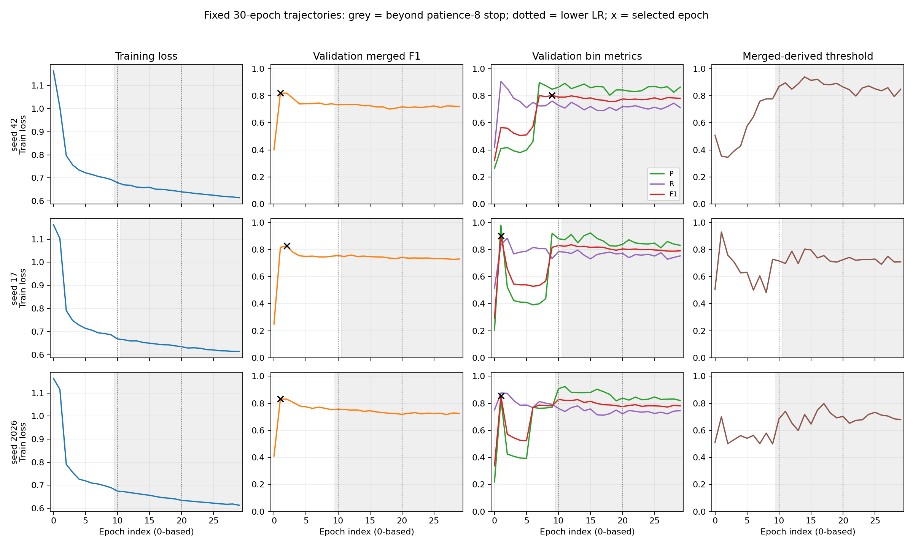

# P6 三seed训练预算与checkpoint selector最终复盘

日期：2026-10-02（Asia/Shanghai）。状态：**训练与分析全部完成；预算NO-GO，selector NO-GO；建议Scientific Freeze**。

训练分支 `experiment/p6-tcn-budget-prefix`，执行commit `fd25bffe1bccdbe54309fceb7f0ecf1454bb3a03`。
分析分支 `analysis/p6-tcn-training-budget`，执行commit `e3ff9fac84d067bb6d517b6a3eb456c089c1a434`。
三个训练任务和分析任务均exit0，完成清单为 `COMPLETE_DEVELOPMENT_ONLY`。
本轮没有Test推理、Test模型选择、native Fit-OOS RCA训练或新完整E2E结果。
当前RCA保留68D＋冻结XGB及Train导出的25.621s anchor backdate。

## A. 当前最终实验结果

### A1. 延长训练是否有效

保持模型、数据、onset30/IGNORE目标、loss、优化器、原StepLR、merged threshold/selector不变，
仅将patience8改30，上限仍30。每seed保存全部30轮权重和原始Validation输出。
用原规则重放**同一实测随机训练轨迹**的patience8前缀；这不是第二次独立训练，
也不是历史checkpoint的继续训练。epoch index均为0-based。

| seed | 实跑epoch | patience8停止epoch数 | 前缀selected index | 30epoch selected index | 最佳merged F1 | 末轮merged F1 | Train loss 首→末 |
| --- | --- | --- | --- | --- | --- | --- | --- |
| 42 | 30 | 10 | 1 | 1 | 0.819113 | 0.720080 | 1.162920 → 0.614209 |
| 17 | 30 | 11 | 2 | 2 | 0.826874 | 0.730064 | 1.162382 → 0.613685 |
| 2026 | 30 | 10 | 1 | 1 | 0.831816 | 0.724145 | 1.163671 → 0.612563 |

三个seed在原停止点之后都没有恢复到更好的merged key；30epoch与前缀最终选择完全相同。
两次学习率下降均已实际覆盖：index0–9=.001，10–19=.0005，20–29=.00025。
Train loss是原训练循环各有效batch masked loss的平均，不是全数据逐bin平均。

灰色区域为原patience8停止点之后；虚线为较低学习率生效点；黑色x为选中的epoch。
[90轮逐行记录](p6_training_budget_20261002/epoch_history.csv)、[SVG](p6_training_budget_20261002/training_budget_curves.svg)。

### A2. 相同轨迹上的单变量selector对照

Validation完整GT=**2,901**。逐窗口C0基准2103/19/798，P/R/F1=.991046/.724922/.837348。
以下均为**独立bin输出**；“原merged selector”表示checkpoint和tau按merged评价产生，
不能将这些bin数值误称为merged指标。前缀和30epoch的原selector bin结果完全相同。

| seed | checkpoint key | selected index | 该轮merged tau | TP / FP / FN | bin P | bin R | bin F1 |
| --- | --- | --- | --- | --- | --- | --- | --- |
| 42 | 原merged selector | 1 | 0.354225993 | 2625 / 3776 / 276 | 0.410092 | 0.904860 | 0.564395 |
| 42 | bin selector | 9 | 0.777394116 | 2208 / 394 / 693 | 0.848578 | 0.761117 | 0.802471 |
| 17 | 原merged selector | 2 | 0.758199990 | 2562 / 2337 / 339 | 0.522964 | 0.883144 | 0.656923 |
| 17 | bin selector | 1 | 0.928916454 | 2423 / 51 / 478 | 0.979386 | 0.835229 | 0.901581 |
| 2026 | 原merged selector | 1 | 0.699875653 | 2540 / 507 / 361 | 0.833607 | 0.875560 | 0.854069 |
| 2026 | bin selector | 1 | 0.699875653 | 2540 / 507 / 361 | 0.833607 | 0.875560 | 0.854069 |

bin selector只改变checkpoint key为该轮bin F1、bin recall、原merged tau，精确tie保留最早epoch。
每轮tau沿用已生成的merged exact sweep结果，没有重新搜索bin tau。
三个bin最佳index9/1/1也全部处于原早停前缀之内。

本表是**新训练轨迹**。同seed的历史模型权重不同；不能把新Validation值与旧Test值组成同一模型的跨split结果。

### A3. Failure decomposition与时间分层

以下是bin selector候选。每个完整GT仅一个失败位置类别；FP另行保留。

| seed | TP | FP | below threshold | competition | no legal | no new episode |
| --- | --- | --- | --- | --- | --- | --- |
| 42 | 2208 | 394 | 419 | 273 | 1 | 0 |
| 17 | 2423 | 51 | 240 | 237 | 1 | 0 |
| 2026 | 2540 | 507 | 120 | 240 | 1 | 0 |

各行TP+三个漏检位置+no-new=2901；below+competition+no-legal分别为693/478/361个FN。
全部9组control/budget/selector matching和ledger均通过闭合检查。
competition定位匹配失败位置，其数目不等于不可改善的物理上限。

| seed | 前半段R增益 | 后半段R增益 | single-onset R增益 | 前半段FP | 后半段FP |
| --- | --- | --- | --- | --- | --- |
| 42 | +0.021260 | +0.047823 | +0.020230 | 102 | 292 |
| 17 | +0.093701 | +0.123237 | +0.090044 | 20 | 31 |
| 2026 | +0.142520 | +0.156959 | +0.134470 | 26 | 481 |

两半GT分别1270/1631，single-onset GT2521；均分层既有全局matching，没有边界重匹配。
selector的memory检测仅22/15/18，分母110，召回.2000/.1364/.1636。
Validation file_moving仅8例，seed17 selector为0/8，不能由整体F1推出少数类型能力提高。
完整fault/root/duration/onset分层保留在[分析JSON](p6_training_budget_20261002/budget_selector_comparison.json)。

### A4. 此前尝试已全面评价

此前冻结评估覆盖**10个score model、19个detector臂、38套固定68D XGB接入比较、2个RCA特征消融**，
并重放P5/C1历史结果。范围包括legacy、逐窗口C0、GPU control、长事件加权、metric drift、flat XGB、
onset30、三个TCN seed的merged/bin/aux、legacy-rise。正常预测和Persistence仅完成Fit筛查并NO-GO；
raw-mask未执行，native TCN Fit-OOS RCA未执行，错误label-lag/64个diagnostic control不算正式候选。

代表性历史Test结果如下，GT=5787；均为前一轮已经封存的观察，当前预算没有新Test结果：

| 历史臂 | detector P / R / F1 | 回溯XGB Full E2E F1@1 / @3 / @5 |
| --- | --- | --- |
| window-causal C0 | .9945 / .7173 / .8335 | .7407 / .8322 / .8326 |
| TCN42 bin | .9969 / .8802 / .9349 | .8395 / .9327 / .9337 |
| TCN17 bin | .9831 / .8965 / .9378 | .8422 / .9353 / .9362 |
| TCN2026 bin | .9750 / .8343 / .8992 | .8165 / .8977 / .8982 |

所有既有臂的完整数值：[detector19](p6_training_budget_20261002/historical_detector_19.csv)、
[RCA/E2E40](p6_training_budget_20261002/historical_rca_e2e_40.csv)、
[failure40](p6_training_budget_20261002/historical_failure_40.csv)、[strata40](p6_training_budget_20261002/historical_strata_40.csv)。
原完整A–G复盘：[此前报告](/home/zhangll24/RCA_project/Ada-MGAD-e2e-v2-testreport/docs/P6_FROZEN_TEST_COMPARISON_RESULTS_20261002.md)。

## B. 结果是否可信

**本轮产物和指标算术有效；证据等级是复用Validation的开发结果。**

- 三个完整30epoch及分析exit0；所有完成清单文件SHA验证通过，实际源码和输入执行前后保持一致。
- 训练源剥除记录接口后的AST与原训练源一致；全部90轮observer RNG未改变，保存既有分数，没有额外训练前向。
- 三seed原patience8逻辑逐字段重放一致，所选前缀权重/分数实际SHA绑定；声明独立control run=false。
- 每组score的sample index、时间、target与同一Val cohort一致，完整2901 GT身份/标签一致。
- 9组正式bin TP/FP/FN与记录时的独立greedy计数完全一致，matching与failure账本闭合；所有FP和漏检进入分母。
- 三seed真实窗口graph独立gate均通过。沿用label-free原70% Train预处理，其中含Detector Validation；
  这不是严格prefix preprocessing-OOS，原始Trace parent在当时是否可用的限制保留。
- 预算训练/选择未使用Test遥测、预测或指标；全局registry只用interval/domain路由，未构造Test目标。
  本报告单独引用前一轮已封存Test结果，该Test已反复使用，属于描述性观察。
- 没有scaler/anchor/threshold/cohort静默变更。XGB未重训且无scaler，68D和25.621s语义不变。

早期历史精确复现尝试三次在epoch0停止；两次确定性配对在完整epoch之前因性能回退取消。
它们均INCOMPLETE，不算模型NO-GO。原目录未覆盖，
[独立归档](p6_training_budget_20261002/diagnostic_attempts_archive.json)绑定全部现存文件。
8-batch真实Fit探针发现原默认GPU实现存在微小跨运行数值差异；
旧运行的完整runtime未归档，不能把所有旧新差异都归因于cuDNN。
同轨迹前缀设计控制了本轮预算归因中的跨运行差异，也保留了原backend复现限制。

## C. B vs C为什么改善；本轮为什么没有恢复

既有C1在相同4197个legal matched Test case上，A/B/C AC@1=.9338/.4980/.6945；
C−B=+.196569，双方/B独有/C独有/均错=1408/682/1507/600。
它支持detector-aligned RCA supervision，证据范围仍受共享预处理、旧batch graph与复用Test限制。
既有68D XGB original/backdate AC@1=.7370/.8899；该训练与评价anchor对齐收益已经封存。
本轮没有改变这些RCA模型或重新评价C1。

预算结果直接不支持当前固定配置下的“早停阻止后期恢复”假设：
Train loss持续下降，两次降LR后的merged与bin最佳都仍位于原停止点之前。
结论适用于本轮30epoch、原优化器/LR/目标/输入；不能由此推断所有其它训练策略永远无效。

selector对seed42和17的bin F1增益分别为+.238077和+.244658；seed2026为0。
这是同一轨迹改变checkpoint key的开发增益。跨seed共同稳定性仍未达到。
原merged key/threshold与最终bin报警单位存在不一致：连续高分段在merged下只算一个报警，
bin下则每个高分bin承担误报成本。选中的tau变化对应不同的bin P/R，但当前对照没有分离阈值算法效应。
因此可以定位评价单位与选择规则的错位，尚不能声称单改threshold一定会解决泛化问题。

## D. 当前最大瓶颈

1. **训练预算已经验证；目前未解决的是最终报警单位上的跨seed、跨时间误报稳定性。**
   seed17 selector只略低于P=.98（实际.979386），但seed42/2026的P=.848578/.833607明显较低。
   原selector seed17前半段FP2213、后半段124；seed2026前半段26、后半段481。
   这些位置说明误报具有明显时间聚集，现有数据不足以判定是活动异常、未登记异常、输入缺失或其它原因。
   NEG表示当前目标没有新onset，不能直接等同于系统健康；不改GT挽救结果。
2. **检测召回和RCA Top1都仍影响完整两阶段结果。**历史TCN42 bin回溯XGB的Top1 FN1213=
   693 detector miss+2 context+518排名错误；TCN17为1128=599+3+526。
   @3/5几乎贴近Stage1；Top1 ranking有残差，但当前两项简单删特征消融没有复现稳定收益。
3. **GAIA结构与数据支持不足。**30s时间格、一对一匹配、多onset竞争、短事件和根因偏斜均保留。
   旧RCA Train3225中memory仅25，file仅3，多种Test fault没有Train支持。
   历史Test memory204中三个TCN bin仅检测36/37/35，固定回溯RCA后各仅4个完整Top1正确。
   原68D逐维Train-only anchor-shift敏感性排序尚未完成；本轮没有新增支持该方向的证据。

## E. 最值得尝试的1–2个最小方向

本轮已按顺序完成两个最小方向：**patience预算**、**checkpoint selector**。
两者均未达到三seed共同门槛，建议结束当前模型搜索。

后续若重新开启研究，优先新增未使用的时间块/数据，并补充memory与稀有根因的训练支持，
先验证数据和报警评价单位。当前没有足够证据支持追加epoch、seed、RCA模块、feature mask或ensemble。
这是一项未来研究建议，没有自动启动新的预处理、训练或Test评价。

## F. 验证实验和GO/NO-GO

| 假设 | 实际实验 | GO条件 | 结果 |
| --- | --- | --- | --- |
| H1 原早停过早 | 三seed固定30epoch，重放同轨迹patience8前缀 | 停止后恢复更好的merged key，且全部seed开发门槛通过 | 三seed均无late recovery；NO-GO |
| H2 checkpoint key错位 | 同一冻结轨迹，仅merged key→bin key，原tau不变 | 全部seed开发门槛通过 | 42/17部分改善，2026不变；NO-GO |

所有seed分别要求P≥.98，较逐窗口C0 R增益≥.05、F1增益≥.02，single-onset R下降≤.03，
预定两半段各R增益≥.03。所有source/input/cohort/matching/ledger gate通过，不选择best seed。

bin selector实际失败门槛及基准增益：

| seed | 未通过的门槛 | R增益 | F1增益 |
| --- | --- | --- | --- |
| 42 | f1_gain、first_half、precision_floor、recall_gain | +0.036194 | -0.034877 |
| 17 | precision_floor | +0.110307 | +0.064233 |
| 2026 | f1_gain、precision_floor | +0.150638 | +0.016720 |

seed17除precision外全部通过，应如实报告其接近门槛；三seed结论还受42/2026较大的precision差距影响。
预算三seed均未通过precision和F1增益。未依据Test降低门槛、换seed、重选tau或offset。
检测阶段未GO，因此没有打开额外Val RCA transfer/native Fit-OOS训练；
本轮 `full_e2e_run=false`，此前Test scorer transfer不追溯赋予native训练身份。

## G. 是否继续优化还是Scientific Freeze

**建议Scientific Freeze。**保留已封存的全部Test正向观察、预算/selector负向结果和复现限制，
进入论文中的结果表、decoder/anchor归因、minority failure与限制讨论。
当前证据不支持用延长原训练预算解决稳定性；重复使用同一Test继续选择模型的科学收益较低。
新的研究应以新的未用数据、明确报警协议和少数类型支持为条件。

## 正式run与复现入口

- 训练根目录：`/home/zhangll24/RCA_project/Ada-MGAD-e2e-v2-c0budgetprefix/experiments/p6/c0_training_budget/`。
- 三个完整run：`seed42-prefix-budget-v1-20261002`、`seed17-prefix-budget-v1-20261002`、`seed2026-prefix-budget-v1-20261002`。
- 分析：`experiments/p6/c0_training_budget_analysis/budget-selector-prefix-v1-20261002/`。
- render：`experiments/p6/c0_training_budget_analysis/budget-selector-prefix-v1-20261002-render-v1/`。
- 原完整episode/matching/ledger均保留在正式分析run；每轮原始分数与权重保留在训练run。
- [实施协议](P6_COMMON_TRAJECTORY_BUDGET_PROTOCOL.md)、[分析协议](P6_TCN_BUDGET_SELECTOR_ANALYSIS_PROTOCOL.md)。
- package来源及SHA：[PROVENANCE](p6_training_budget_20261002/PROVENANCE.json)、[MANIFEST](p6_training_budget_20261002/MANIFEST.csv)。

主工作树原有文档改动保留；未覆盖任何旧实验目录或共享预处理产物。
